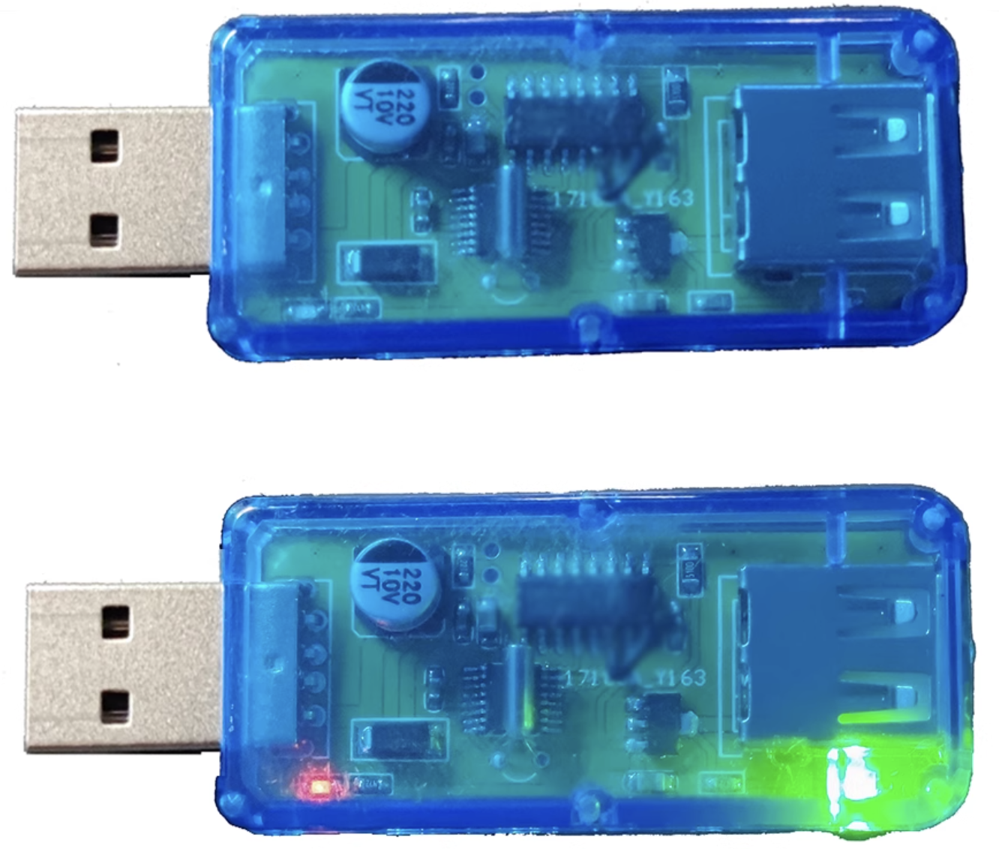

# 乒乓球设备改造


<br/><br/><br/>

# 优先使用、这个最简单：无焊接、不用拆开设备，直接链接usb串口继电器
### 1.  在淘宝上购买带盒子的5v电压usb串口继电器 [USB2.0电源可控信号直通](https://item.taobao.com/item.htm?_u=41iuu0tie499&id=638997883520&spm=a1z09.2.0.0.7a9e2e8dWu9xlJ&skuId=4867023936716)


### 2. 乒乓球设备自带的电源线插入购买的usb串口继电器， 然后再接电脑就可以了


<br/><br/><br/>

# 备用一： 拆开盒子、加入`继电器`， 用usb公母延长线替换掉原来的线
继电器使用的是在`淘宝`上购买的：[1路免驱、usb串口控制继电器](https://detail.tmall.com/item.htm?_u=31iuu0tic61b&id=624900251710&spm=a1z09.2.0.0.5a2b2e8dkC6p8P)


```python
# 不同继电器，控制开和关的指令可能不同
message = bytes.fromhex('A0 01 01 A2')    # 继电器开指令， 发球
ser.write(message)
。。。
message = bytes.fromhex('A0 01 00 A1')  # 继电器关指令
ser.write(message)
```
<br/>

### 1、 拆掉2个螺丝， 让usb公母延长线深进来


### 2、剪断链接下面电池的2根线


### 3、按照图所示焊接、连线


<br/><br/><br/>

# 备用二： 不用拆开盒子， 还是用原来的线， 这里买的是一个`没带盒子`的usb`继电器`
继电器使用的是在`淘宝`上购买的：[1路免驱、usb串口控制继电器](https://detail.tmall.com/item.htm?_u=31iuu0tic61b&id=624900251710&spm=a1z09.2.0.0.5a2b2e8dkC6p8P).


### 不用拆开盒子， 还是用原来的线


缺点： 这个串口继电器是裸露的，还要自己额外找个盒子。 另外，还是**需要焊接2条线。**