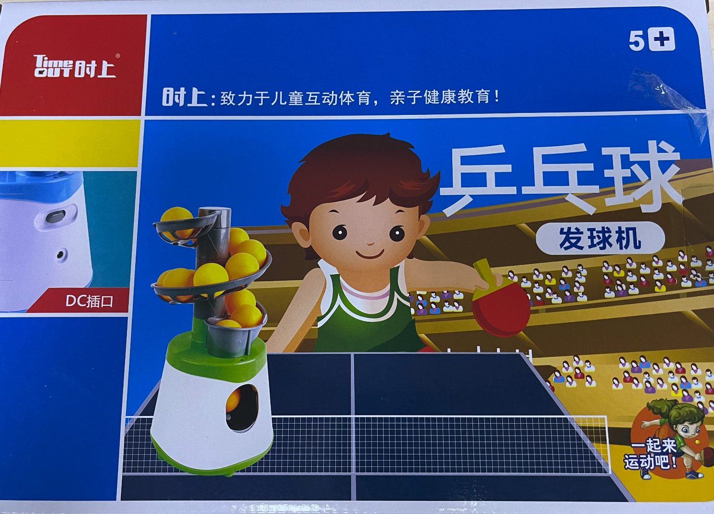
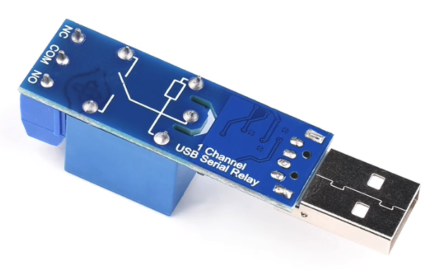
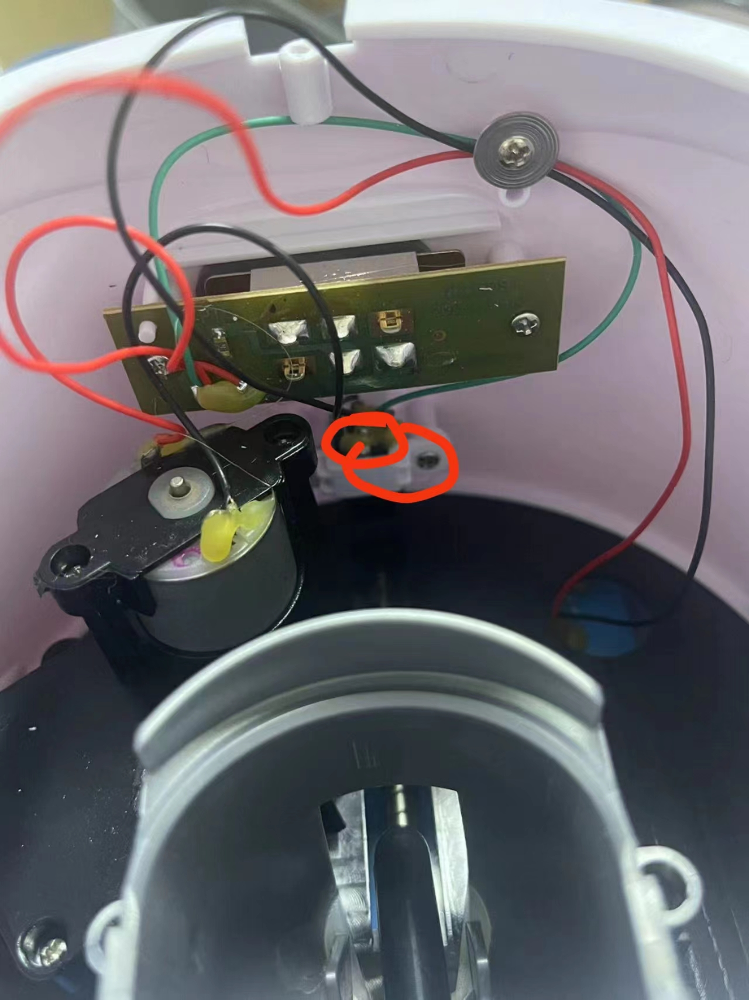
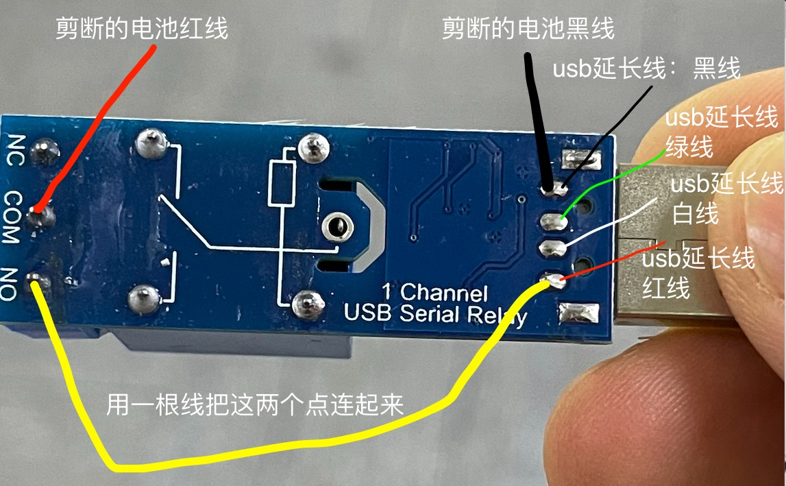

# 乒乓球设备改造



<br/><br/><br/>

# 方法一： 拆开盒子、加入`继电器`， 用usb公母延长线替换掉原来的线
继电器使用的是在`淘宝`上购买的：[1路免驱、usb串口控制继电器](https://detail.tmall.com/item.htm?_u=31iuu0tic61b&id=624900251710&spm=a1z09.2.0.0.5a2b2e8dkC6p8P)



```python
# 不同继电器，控制开和关的指令可能不同
message = bytes.fromhex('A0 01 01 A2')    # 继电器开指令， 发球
ser.write(message)
。。。
message = bytes.fromhex('A0 01 00 A1')  # 继电器关指令
ser.write(message)
```
<br/>

### 1、 拆掉2个螺丝， 让usb公母延长线深进来


### 2、剪断链接下面电池的2根线


### 3、按照图所示焊接、连线


<br/><br/><br/>

# 方法二： 不用拆开盒子， 还是用原来的线， 买一个带盒子而且是usb公母接口的`继电器`
继电器使用的是在`淘宝`上购买的：[1路免驱、usb串口控制继电器](https://detail.tmall.com/item.htm?_u=31iuu0tic61b&id=624900251710&spm=a1z09.2.0.0.5a2b2e8dkC6p8P).


### 不用拆开盒子， 还是用原来的线


缺点： 这个串口继电器是裸露的，还要自己额外找个盒子。